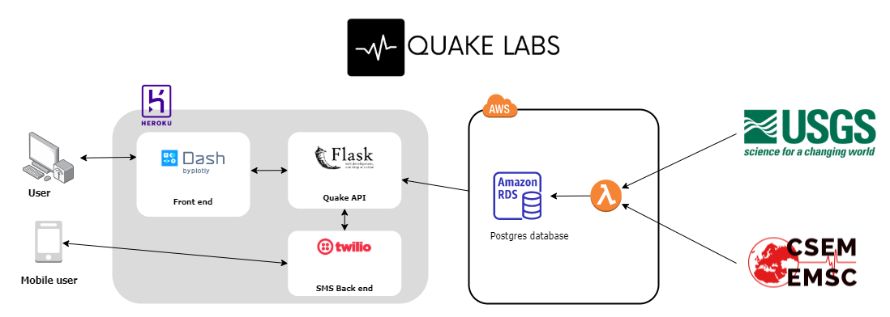

## Project Overview

[Trello Board](https://trello.com/b/5WH9iB9n/labspt7-quake)<br>
[Product Canvas](https://www.notion.so/User-Research-8cd64de109404266b2537457a426738d)

## Team Members


|                                       [Eyve Geordan](https://github.com/eyvonne)                                        |                                       [J Tyler Sheppard](https://github.com/jtsheppard)                                        |                                       [Ashwin Swamy](https://github.com/ash12hub)                                        | [Harsh Desai](https://github.com/hurshd0)|
| :-----------------------------------------------------------------------------------------------------------: | :-----------------------------------------------------------------------------------------------------------: | :-----------------------------------------------------------------------------------------------------------: | :-----------------------------------------------------------------------------------------------------------: |
|                      [](https://github.com/eyvonne)                       |                      [](https://github.com/jtsheppard)                       |                      [](https://github.com/ash12hub)                      |[](https://github.com/hurshd0)|
|                 [ ](https://github.com/eyvonne)                 |            [ ](https://github.com/jtsheppard)             |           [ ](https://github.com/ash12hub)            |           [ ](https://github.com/hurshd0)            |
| [  ](https://www.linkedin.com/in/eyvonne-geordan-2a2b55168/) | [  ](https://www.linkedin.com/in/jtsheppard/) | [  ](https://www.linkedin.com/) | [  ](https://www.linkedin.com/in/hurshd/) |

## Endpoints

### How to connect to the data API

Production Endpoint 👉 https://quake-ds-production.herokuapp.com/  
Staging Endpoint 👉 https://quake-ds-staging.herokuapp.com/

#### Overview of Main Routes

| Method | Endpoint                | Access Control | Description                                  |
| ------ | ----------------------- | -------------- | -------------------------------------------- |
| GET    | `/lastQuake/SOURCE/MAGNITUDE` | all users      | Returns the last quake over the given magnitude from the source  |
| GET    | `/last/SOURCE/TIME/MAGNITUDE` | all users      | Gets the quakes over the given timeframe |
| GET    | `/history/SOURCE/LAT,LON,DIST` | all users      | Returns all quakes in a given area |
| GET |`/zip/ZIPCODE/DIST` | all users | Returns last quake in a given area |
| GET, POST | `/comments/SOURCE/QUAKE` | all users |Gets or Posts comments about quakes |
### How to use the routes

1. `/lastQuake/SOURCE/MAGNITUDE` - Returns the last quake over the given magnitude from the source 

`SOURCE`: choice of 'USGS' or 'EMSC' depending on which datasource to pull from 
`MAGNITUDE`: a number 0-11 (accepts floats and ints) defaults to 5.5

2. `/last/SOURCE/TIME/MAGNITUDE` - Gets the quakes over the given timeframe

`SOURCE`: choice of 'USGS' or 'EMSC' depending on which datasource to pull from 
`TIME`: choice of 'hour', 'day', 'week' or 'month', returns quakes over the given time period
`MAGNITUDE`: a number 0-11 (accepts floats and ints) defaults to 5.5

3. `/history/SOURCE/LAT,LON,DIST` - Returns all quakes in a given area

`SOURCE`: choice of 'USGS' or 'EMSC' depending on which datasource to pull from
`LAT` and `LON` are the central latitude and longitude  
`DIST` is the distance in miles from the center to search from

4. `/zip/ZIPCODE/DIST` - reutrns last quake around a given zip code

`ZIPCODE`: a US 5 digit zip code
`DIST`: the distance out to check for the last quake, defaults to 20km

5. `/comments/SOURCE/QUAKE` - gets or posts comments about quakes

`SOURCE`: choice of 'USGS' or 'EMSC' depending on which datasource the quake is in
`QUAKE`: the earthquake's ID number

### Response Format
The history routes will return data in the following format:
```
 "message": Contains the quakes returned in format:
         "Oceanic": a boolean value for if the quake was in the ocean (only for USGS quakes, not reliable),
         "id": A numerical id of the quake in our database (unique per quake),
         "lat": lattitude in degrees
         "lon": longitude in degrees
         "mag": Magnitude of the earthquake
         "place": a Human readable representation of approximatly where the quake is
         "time": the time that the quake occured in UTC in ms since Epoch}
 "num_quakes": the number of quakes returned
 "status_code": standard web status codes
 "boundingA": Only returned on history route, Northwest corner of the bounding box
 "boundingB": Only returned on history route, Southeast corner of the bounding box
 ```
 The comments route will return data in the following format:
 ```
 "message": contains a list of comments in the format:
        "name": the display name of the User
        "comment": the comment
"num_comments": the number of comments returned
"status_code": web status codes
```
## Tech Stack 

  - [Flask](https://flask.palletsprojects.com/en/1.1.x/)
  - [Beautiful Soup](https://www.crummy.com/software/BeautifulSoup/)
  - [AWS Lambda](https://docs.aws.amazon.com/lambda/index.html)
  - [AWS RDS](https://docs.aws.amazon.com/rds/index.html)
  - [Heroku](https://devcenter.heroku.com)

### Architecture



## Data Sources

    Our primary data source is the USGS geojson feed. [View the documentation](https://earthquake.usgs.gov/earthquakes/feed/v1.0/geojson.php), or [search their data](https://earthquake.usgs.gov/earthquakes/search/).
    For a further history of earthquakes we also collected the data available on [EMSC](https://www.emsc-csem.org/Earthquake/)

## Feature requests and Contributions
Source code for the API is available [GitHub](https://github.com/quake-labs/quake-ds)
        Source code for the Dashboard is also available in this repo
        We would love to hear from you about new features which would improve this app and further the aims of our project. Please provide as much detail and information as possible to show us why you think your new feature should be implemented.
        If you have developed a patch, bug fix, or new feature that would improve this app, please submit a pull request. It is best to communicate your ideas with the developers first before investing a great deal of time into a pull request to ensure that it will mesh smoothly with the project.
        Remember that this project is licensed under the MIT license, and by submitting a pull request, you agree that your work will be, too.
